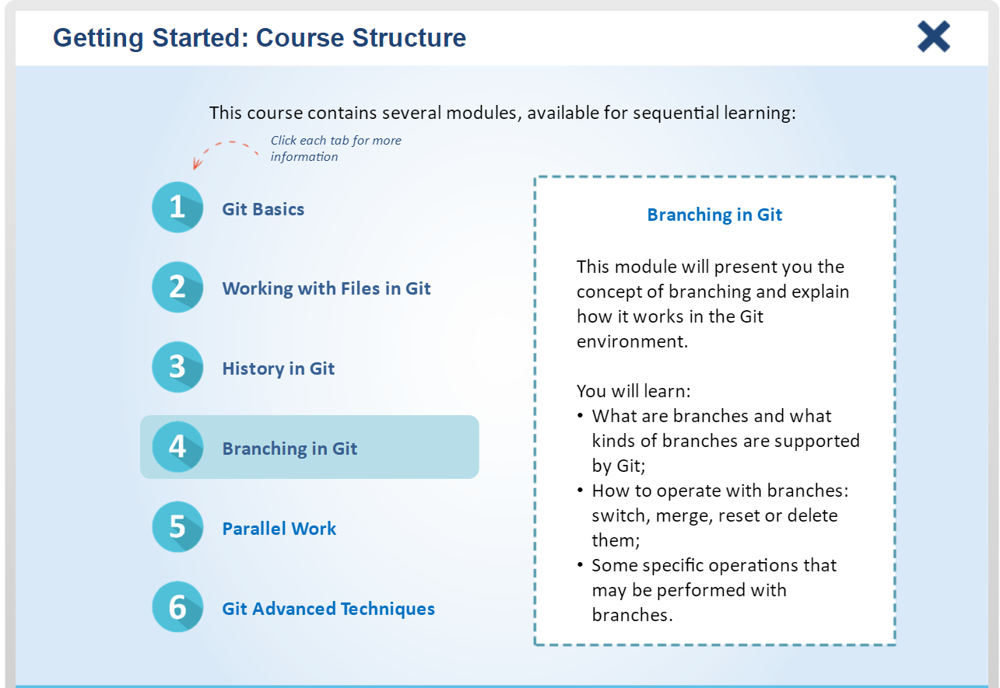
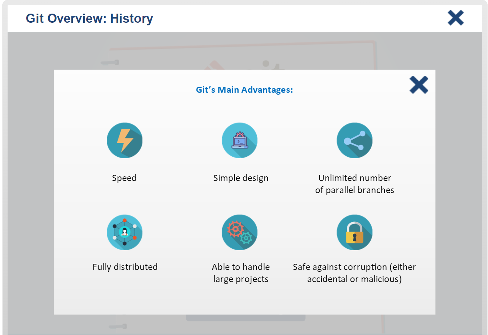
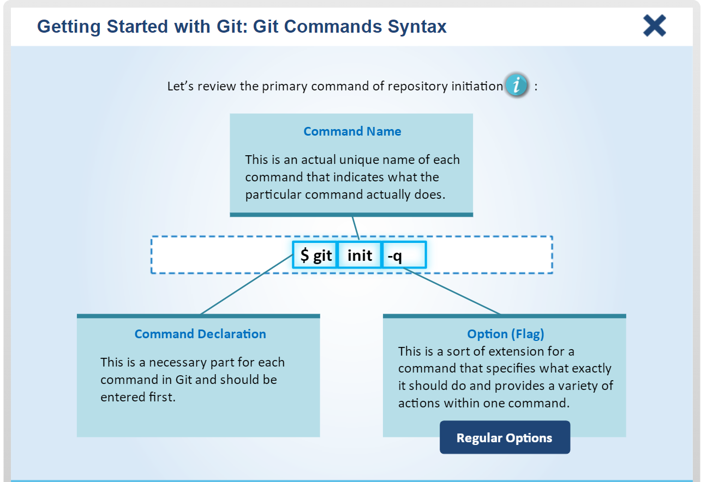
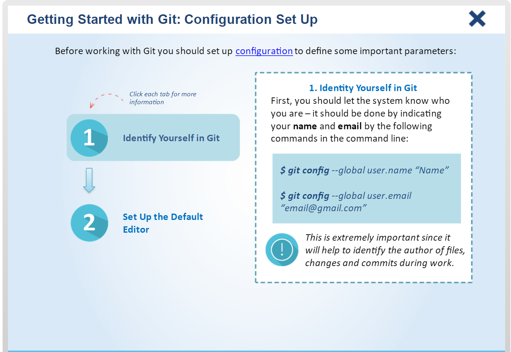

# Git Version Control System

## Chapter 1: Git Basics `40 slides`

### 1.1: Course Structure

    
(10 slides)

     

### 1.2: Git Overview

    
(10 slides)

     

### 1.3: Getting Started with Git

    
(20 slides)

     

