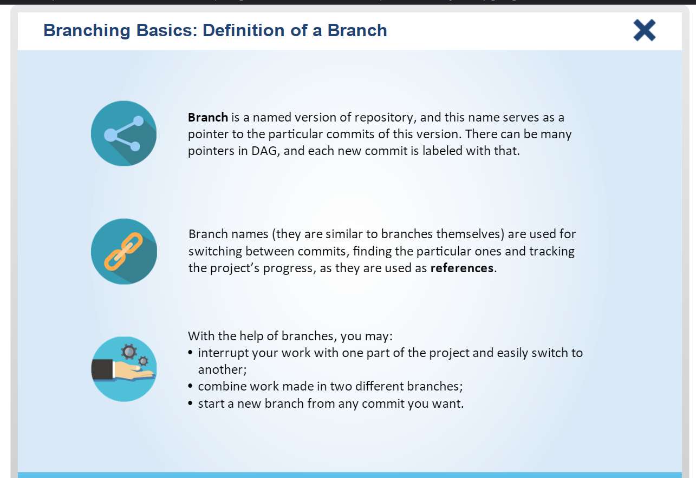
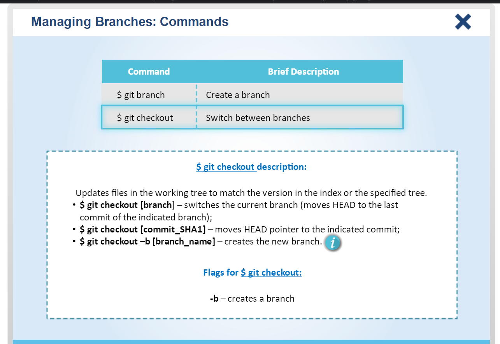

# Git Version Control System

## Chapter 4: Branching `80 slides`

### 4.1: Branching Basics

    
(15 slides)

     

### 4.2: Managing Branches

    
(30 slides)

     

### 4.3: Merging Branches

    
(15 slides)

     

### 4.4: Resolving Conflicts

    
(10 slides)

     

### 4.5: Practice

    
(10 slides)

     

